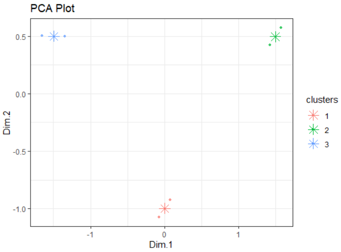

<!-- README.md is generated from README.Rmd. Please edit that file -->

```{r, include = FALSE}
knitr::opts_chunk$set(
  collapse = TRUE,
  comment = "#>",
  fig.path = "man/figures/README-",
  out.width = "100%"
)
```

# KmeaningfulR

<!-- badges: start -->
<!-- badges: end -->

Have you ever encountered a dataset that seems to have different 
patterns in it? Have you ever tried to group similar things together in a dataset and to assign a new sample based on your findings? 

We created `kmeaningfulR` to help solve such problems. `kmeaningfulR` is a R package that uses the k-means algorithm to find clusters and assign new data points to them. It also contains functions to help with data preprocessing, hyperparameter tuning and visualizing clusters.

## Installation

You can install the released version of kmeaningfulR from [CRAN](https://CRAN.R-project.org) with:

``` r
install.packages("kmeaningfulR")
```

## KmeaningfulR's Place in the R Ecosystem

There already exist several packages that implement k-means clustering in R. Most notably there is the `stats::kmeans` implementation. There are also several functions for modified versions of k-means available in the `ClusterR` package. We are not trying to break new ground with `kmeaningfulR`, but rather to build a simple and lightweight implementation from scratch.

## Features

1. `preprocess(X)` - Automatic dataset preprocessing: scales numerical features
2. `find_elbow(X)` - Automatic hyperparameter tuning to select optimal number of clusters, `k`, according to silhouette score
3. `fit_assign(X, k)` - Wrapper function that calls `fit(X, k)` and `assign(X, centres)`
    - `fit(X, k)` - finds centroid location for all of the `k` clusters
    - `assign(X, centres)` - assigns each example to a cluster
4. `show_clusters(X, centres)` - Visualize clusters according to 2d PCA representation

## Dependencies

- R 4.0.3
- cluster 2.1.1
- FactoMineR
- forcats
- dplyr

## Usage

```{r usage-example}
library(kmeaningfulR)

# helper data X
X  <- array(c(0, 1, 10, 10, 10, 10, 0, 1, 10, 11, 0, 1), dim = c(6,2))
# scale data
X_scaled <- preprocess(X)
# find optimal number of clusters
optimal_K <- find_elbow(X_scaled)
# find location of cluster centers
centers <- fit(X_scaled, optimal_K)
# assign label of nearest center to every point
labels <- assign(X_scaled,centers)
# plot a 2D PCA visualisation of the points clusters
show_clusters(X_scaled, labels, centers)

```



| Task | Function  |
|------------|-----|
| Scale numerical features| `preprocess(df)`|
| Find list of centroid points| `fit(df, 3)`|
| Assign new data point to cluster| `assign(df, array2d)`|
| Find optimal number of cluster| `fit_elbow(X)`|
| Visualize data coloured by cluster| `show_cluster(df, array2d)`|

## Documentation

The official documentation is hosted on Read the Docs: https://kmeaningfulR.readthedocs.io/en/latest/

## Contributors
This project was created by DSCI 524 Group 16: 

- Yihong (Hazel) Jiang
- Mike Lynch
- Trevor Kinsey
- Sasha Babicki

We welcome and recognize all contributions. You can see a list of current contributors in the [contributors tab](https://github.com/UBC-MDS/kmeaningfulR/graphs/contributors).
